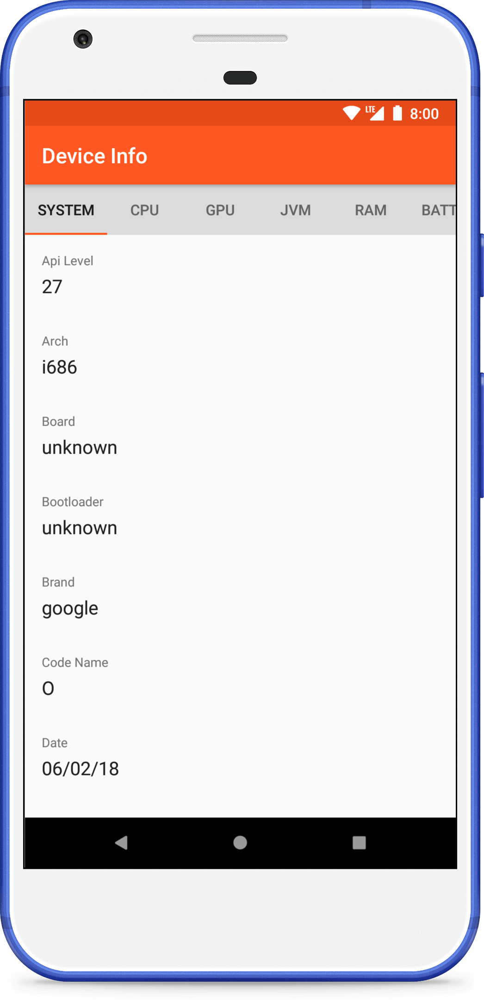
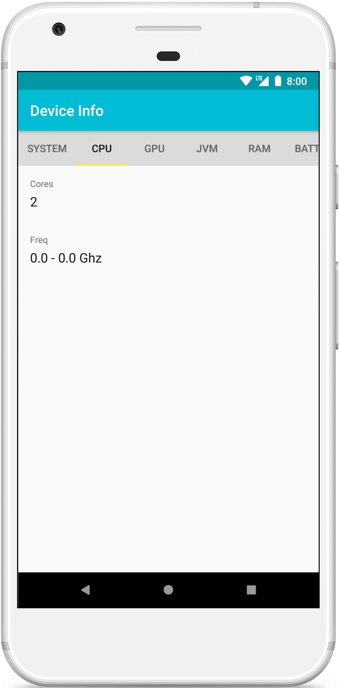
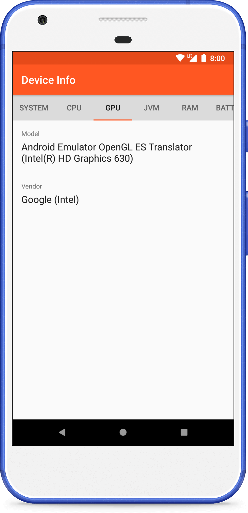
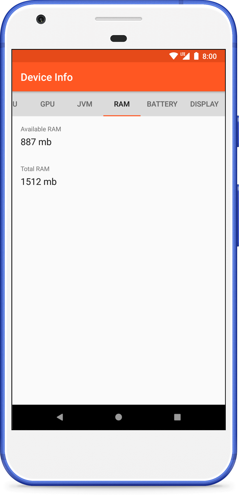
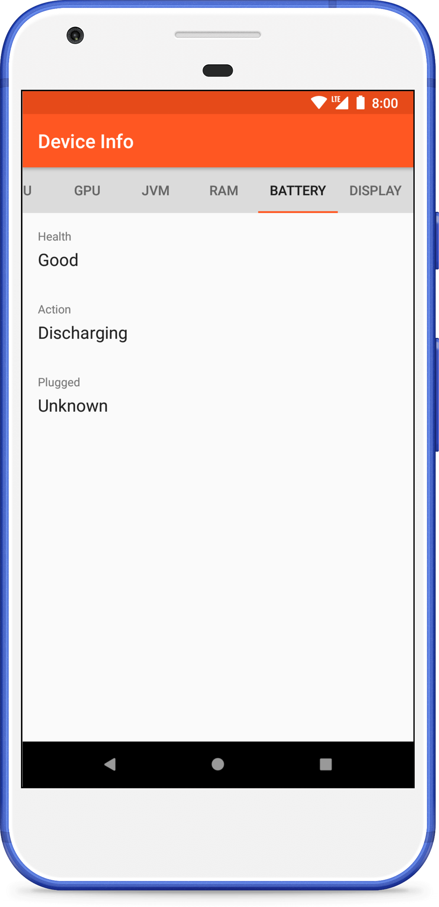

# Android Device Info

[](https://github.com/fartem/android-device-info/actions?query=workflow%3ABuild)
[](https://codebeat.co/projects/github-com-fartem-android-device-info-master)
[](https://codecov.io/gh/fartem/android-device-info)
[](https://android-arsenal.com/details/3/7904)

## About

Demo app for displaying information about Android device.

__Available information about device__

| Section | Values |
| --- | --- |
| `System` | Api Level, Arch, Board, Bootloader, Brand, Code Name, Date, Fingerprint, Hardware, Host, Kernel Version, Manufacturer, Model, Product, Release Version, Type, User |
| `CPU` | Cores, Frequency |
| `GPU` | Model, Vendor |
| `JVM` | JVM |
| `RAM` | Available RAM, Total RAM |
| `Battery` | Health, Action, Plugged |
| `Display` | Density DPI, Density, Display, Height Pixels, Scaled Density DPI, Width Pixels, XDPI, YDPI |

## Screenshots

<br/>
<p align="center">
  
  
  
  
  
</p>

## How to contribute

Read [Commit Convention](https://github.com/fartem/repository-rules/blob/master/commit-convention/COMMIT_CONVENTION.md). Make sure your build is green before you contribute your pull request. Prepare any API 22 emulator. Then:

```shell
$ ./gradlew clean
$ ./gradlew build
$ ./gradlew -Pandroid.testInstrumentationRunnerArguments.class=com.smlnskgmail.jaman.deviceinfo.info.travisci.Api22TestSuite connectedCheck
```

If you don't see any error messages, submit your pull request.

## Contributors

* [@fartem](https://github.com/fartem) as Artem Fomchenkov
* [@artem385](https://github.com/artem385) as Artem Fomchenkov
