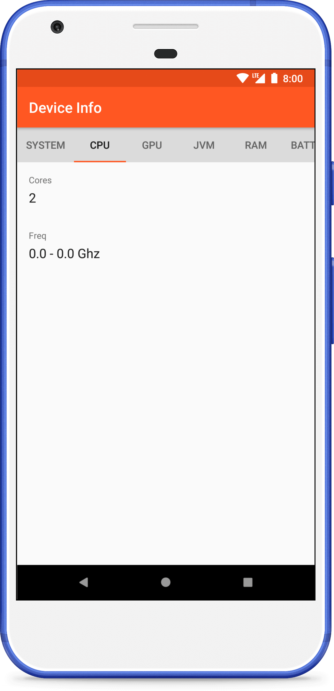
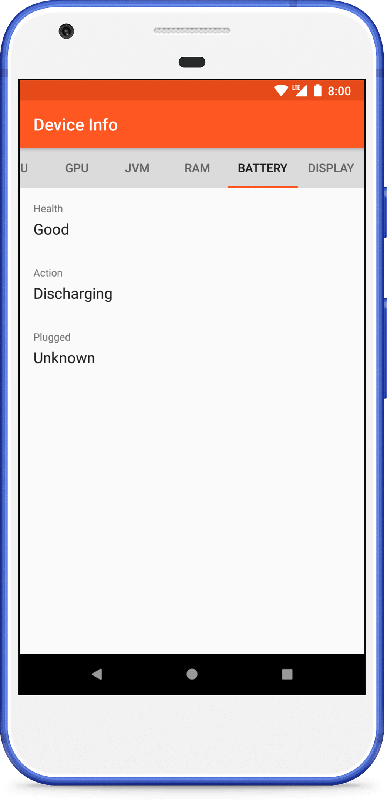

Android Device Info
=============

[](https://travis-ci.org/fartem/android-device-info)
[](https://codecov.io/gh/fartem/android-device-info)
[](https://android-arsenal.com/details/3/7904)
[](https://github.com/fartem/android-device-info/issues)

About
-------------

Demonstration app for displaying information about Android device.

Downloads
-------------


Screenshots
-------------

<br/>
<p align="center">
  
  
  
  
  
</p>

How to contribute
-------------

Read [Commit Convention](https://github.com/fartem/repository-rules/blob/master/commit-convention/COMMIT_CONVENTION.md). Make sure your build is green before you contribute your pull request. Then:

```shell
gradlew clean
gradlew build
gradlew -Pandroid.testInstrumentationRunnerArguments.class=com.smlnskgmail.jaman.deviceinfo.info.travisci.Api22TestSuite connectedCheck
```

If you don't see any error messages, submit your pull request.

Contributors
-------------

* [@fartem](https://github.com/fartem) as Artem Fomchenkov