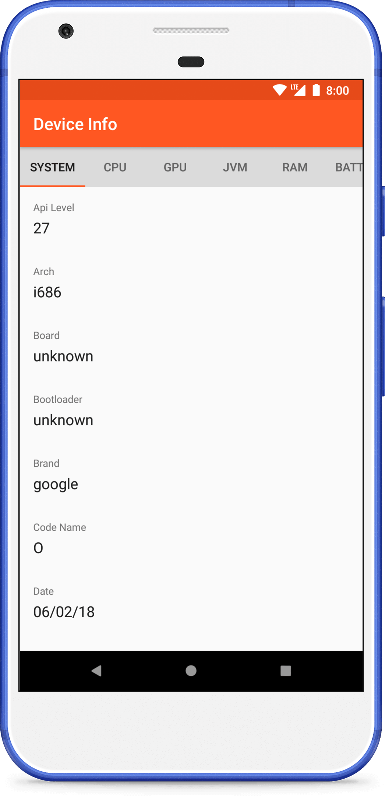
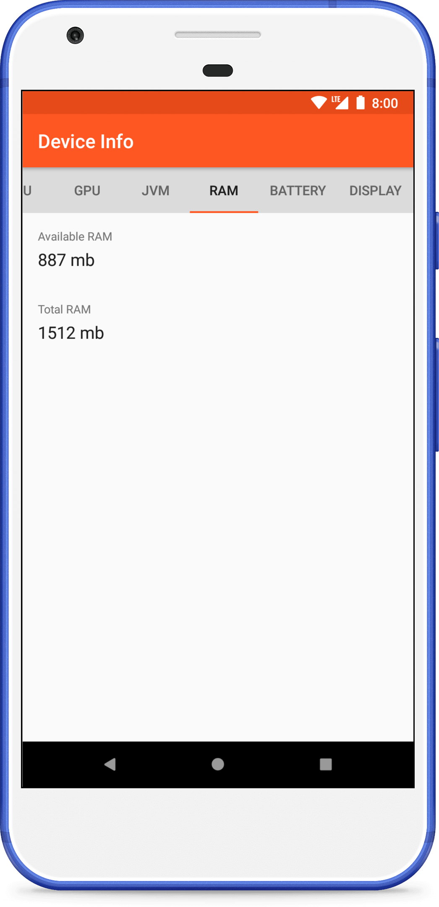

Android Device Info
=======================

About
-------------------

Demonstration app for displaying information about Android device.

Downloads
-------------------

Screenshots
-------------------

 

  
  
  
  

 

  
  
  

Contributors
-------------------

* [@fartem](https://github.com/fartem) as Artem Fomchenkov